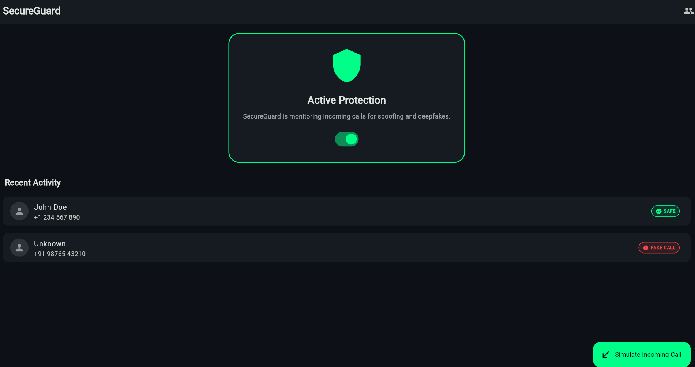
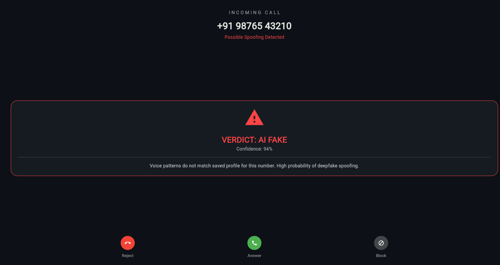

# SecureGuard
## Unified Enterprise Security Platform
### Team: Future Builders | Hackathon: Srijan 2026

```text
   _____                         _____                      _ 
  / ____|                       / ____|                    | |
 | (___   ___  ___ _   _ _ __  | |  __ _   _  __ _ _ __  __| |
  \___ \ / _ \/ __| | | | '__| | | |_ | | | |/ _` | '__|/ _` |
  ____) |  __/ (__| |_| | |    | |__| | |_| | (_| | |  | (_| |
 |_____/ \___|\___|\__,_|_|     \_____|\__,_|\__,_|_|   \__,_|
```

SecureGuard is a comprehensive security suite addressing two critical enterprise challenges:
1. **FakeCall Detector (PS-08)**: On-device voice biometric authentication for mobile calls.
2. **OSS SecureScore CLI (PS-14)**: Automated security risk assessment for open-source dependencies.

---

## 🏗 Architecture

```
┌─────────────────────────────────────────────────────┐
│                   SecureGuard Platform               │
│              "Zero Trust. Zero Cloud."               │
└──────────────────────┬──────────────────────────────┘
                       │
        ┌──────────────┴──────────────┐
        │                             │
┌───────▼────────┐           ┌────────▼────────┐
│  PS-08         │           │  PS-14          │
│  FakeCall      │           │  OSS SecureScore│
│  Detector      │           │  CLI            │
│  (Flutter)     │           │  (Python)       │
└───────┬────────┘           └────────┬────────┘
        │                             │
┌───────▼────────┐           ┌────────▼────────┐
│ On-Device AI   │           │ OSV.dev API     │
│ TFLite Model   │           │ NIST NVD API    │
│ Silero VAD     │           │ PyPI API        │
│ Anomaly Engine │           │ GitHub API      │
└───────┬────────┘           └────────┬────────┘
        │                             │
┌───────▼────────┐           ┌────────▼────────┐
│ Local SQLite   │           │ Local SQLite    │
│ (Voiceprints) │           │ (Offline Cache) │
└────────────────┘           └─────────────────┘

⚠️  NO DATA LEAVES THE DEVICE / MACHINE — EVER
```

---

## 🛠 Project Structure

- `fakecall-app/`: Flutter mobile application for real-time call screening.
- `osscore-cli/`: Python CLI tool for security auditing of pip/npm packages.
- `demo/`: Screenshots > 📸 See /demo/screenshots/ folder for all screenshots.

## 🖼️ Gallery

### FakeCall Detector
| Dashboard | Call Detection |
|-----------|----------------|
|  |  |

### OSS SecureScore > 📸 See /demo/screenshots/ folder for all screenshots.
  


---

## 🤖 Responsible AI

| Principle | Implementation |
|-----------|---------------|
| Confidence Thresholds | Verdict only given when score confidence > 70% |
| Human-in-the-Loop | User always sees score + can override any decision |
| No PII Storage | Voice embeddings stored as math vectors, not audio |
| Full Audit Logs | Every call result logged locally with timestamp |
| Explainability | Every score shows exactly why (CVE list, rule triggers) |

---

## 🚀 Quick Start

### OSS SecureScore CLI
```bash
cd ossscore-cli
pip install -e .
sg scan requests
```

### FakeCall Detector
```bash
cd fakecall-app
flutter pub get
flutter run
```

---

## 👥 Team: Future Builders

| Name | Role | Contact |
|------|------|---------|
| Kottana Indra Kiran (Team Leader) | Full Stack + AI | +917382538122 |
| Lakki Reddy Jitendar Reddy | Flutter Developer | +918919770435 |
| Kosuru Thanay Kumar | Backend + CLI | +917680873868 |
| Karanam Trivedh | DevOps + Testing | +919100834835 |

**Hackathon:** Srijan 2026 by Atos Global IT Solutions
**Problem Statements:** PS-08 (FakeCall Detector) + PS-14 (OSS SecureScore)
